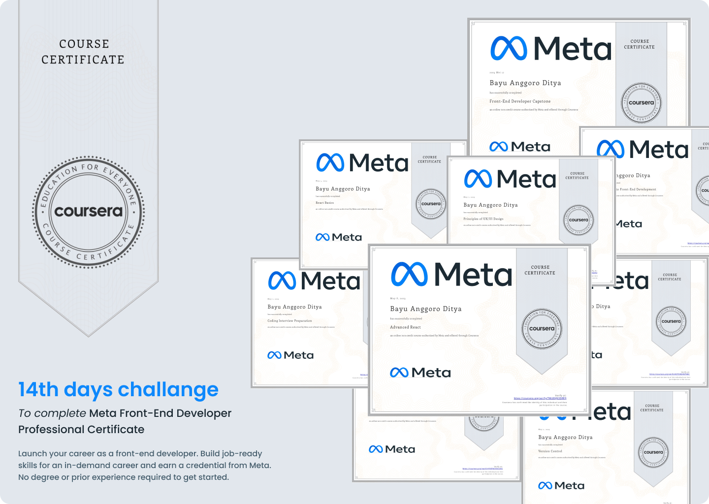

# Meta Front-End Developer Professional Certificate

Launch your career as a front-end developer. Build job-ready skills for an in-demand career and earn a credential from Meta. No degree or prior experience required to get started.

- This repo contains of my assignments and certificate from the 9 courses in the Coursera Professional Certificate: [Meta Front-End Developer Professional Certificate](https://www.coursera.org/professional-certificates/meta-front-end-developer)

[See my post in LinkedIn](https://www.linkedin.com/feed/update/urn:li:activity:7064612113582862336/)

---

## Table of Content

### Introduction to Front-End Development

> What You Will Learn

✔️ Distinguish between front-end, back-end, and full-stack developers.

✔️ Create and style a webpage with HTML and CSS.

✔️ The benefits of working with UI framework.

> The skills you will get

#### `Web Development Tools` `User Interface` `Front-End Web Development` `HTML and CSS` `Responsive Web Design`

[see the course](https://www.coursera.org/learn/introduction-to-front-end-development?specialization=meta-front-end-developer)

### Programing with Javascript

> What You Will Learn

✔️ Creating simple JavaScript codes.

✔️ Creating and manipulating objects and arrays.

✔️ Writing unit testing using Jest

> The skills you will get

#### `Test-Driven Development` `Javascript` `Object-Oriented Programming (OOP)` `Front-End Web Development`

[see the course](https://www.coursera.org/learn/programming-with-javascript?specialization=meta-front-end-developer)

### Version Control

> What You Will Learn

✔️ Implement Version Control systems

✔️ Navigate and configure using the command line

✔️ Use a GitHub repository. Create a GitHub repository

✔️ Revision Code Manage

> The skills you will get

#### `Linux` `Web Development` `Bash (Unix Shell)` `Github` `Version Control`

[see the course](https://www.coursera.org/learn/introduction-to-version-control?specialization=meta-front-end-developer)

### HTML and CSS in depth

> What You Will Learn

✔️ Create a simple form with a responsive layout using HTML5 and CSS

✔️ Create a responsive layout using CSS

✔️ Create a UI using Bootstrap

✔️ Implement debugging tools

> The skills you will get

#### `Debugging` `User Interface` `React ( Web Framework)` `HTML and CSS` `JavaScript`

[see the course](https://www.coursera.org/learn/html-and-css-in-depth?specialization=meta-front-end-developer)

### React Basic

> What You Will Learn

✔️ Use reusable components to render views where data changes over time

✔️ Organize React projects to create more scalable and maintainable websites and apps

✔️ Use props to pass data between components. Create dynamic and interactive web pages and apps

✔️ Use forms to allow users to interact with the app. Build an application in React

> The skills you will get

#### `Web Application` `Front-End Web Development` `React ( Web Framework)` `Application development`

[see the course](https://www.coursera.org/learn/react-basics?specialization=meta-front-end-developer)

### Advanced React

> What You Will Learn

✔️ Create robust and reusable components with advanced techniques and learn different pattern to reuse common behavior

✔️ Interact with a remote server and fetch and post data via an API

✔️ Seamlessly test React applications with React Testing Library

✔️ Integrate commonly used React libraries to streamline your application development

> The skills you will get

#### `Testing Unit` `Front-End Web Development` `React ( Web Framework)`

[see the course](https://www.coursera.org/learn/advanced-react?specialization=meta-front-end-developer)

### Principles UX & UI Design

> What You Will Learn

✔️ Describe the fundamentals of User Experience (UX) design and research

✔️ Describe accessibility considerations in design

✔️ Practice developing user fourhy through research

✔️ Create wireframes and prototypes in Figma

> The skills you will get

#### `Web Design` `Front-End Web Development` `User Experience (UX)` `React ( Web Framework)` `Accessibility`

[see the course](https://www.coursera.org/learn/principles-of-ux-ui-design?specialization=meta-front-end-developer)

### Front-end developer Capstone

> What You Will Learn

✔️ Design and style a responsive User Interface (UI)

✔️ Demonstrate clean and bug free coding

✔️ Use React components to create multiple views

✔️ Create a front-end website using React JS and JavaScript

> The skills you will get

#### `JavaScript` `Front-End Web Development` `Web Development` `React ( Web Framework)`

[see the course](https://www.coursera.org/learn/meta-front-end-developer-capstone?specialization=meta-front-end-developer)

### Coding Interview Preparation

> What You Will Learn

✔️ Prepare for a coding interview

✔️ Prepare for a Meta interview

✔️ Solve problem using code

> The skills you will get

#### `Pseudocode` `Algorithms` `Communication` `Data Structure` `Computer Science`

[see the course](https://www.coursera.org/learn/coding-interview-preparation?specialization=meta-front-end-developer)

## Proof of Completion

- Completion of [Introduction to Front-End Development](https://www.coursera.org/account/accomplishments/verify/GQM8UR4A69MM) certificate
- Completion of [Programming with JavaScript](https://www.coursera.org/account/accomplishments/verify/YF6TWSYDEU8S) certificate
- Completion of [Version Control](https://www.coursera.org/account/accomplishments/verify/J6L8LD64ELAX) certificate
- Completion of [HTML & CSS in depth](https://www.coursera.org/account/accomplishments/verify/KZTD9DKBTNKC) certificate
- Completion of [React Basic](https://www.coursera.org/account/accomplishments/verify/PPMSC73SEFD2) certificate
- Completion of [Advanced React](https://www.coursera.org/account/accomplishments/verify/TWU8VJX3DRFQ) certificate
- Completion of [Principles of UX & UI design](https://www.coursera.org/account/accomplishments/verify/UVSEW62VGEK3) certificate
- Completion of [Front-End Developer Capstone](https://www.coursera.org/account/accomplishments/verify/SSXR7FV6593G) certificate
- Completion of [Coding Interview Preparation](https://www.coursera.org/account/accomplishments/verify/Q2AD84UNLGQ5) certificate
